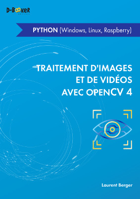

## Traitement d'images et de vidéos avec OpenCV 4
### en Python (Windows, Linux, Raspberry)

Ce dépôt contient les codes sources des exemples du livre [Traitement d'images et de vidéos avec OpenCV 4
 en Python (Windows, Linux, Raspberry)](https://www.d-booker.fr/opencv-py/609-traitement-d-images-et-de-videos-avec-opencv-4-en-python.html), écrit par Laurent Berger et à paraître le 03/01/20201 aux éditions [D-BookeR](http://www.d-booker.fr). 

Si ces exemples vous intéressent et que vous n'avez pas acheté le livre, nous vous invitons à le [faire](https://www.d-booker.fr/opencv-py/609-traitement-d-images-et-de-videos-avec-opencv-4-en-python.html). Sa rédaction est le fruit d'un gros travail et votre soutien nous sera précieux.

